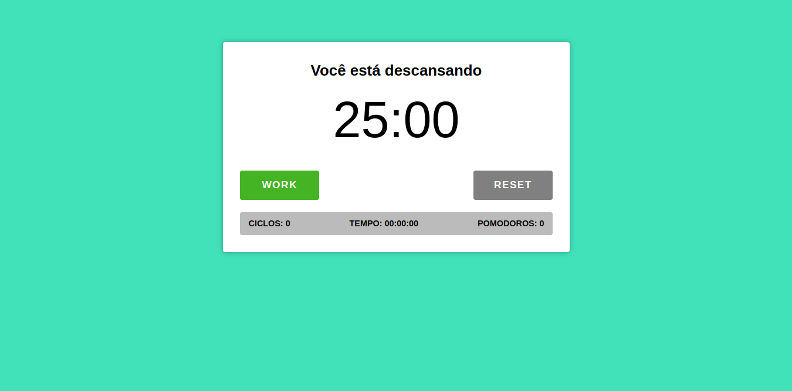

# Pomodoro com Typescript

Aplicação desenvolvida com reactJs e TypeScript, para treinar tipagem no 
front-end.

## Ajustes e melhorias

- [x] Responsividade.
- [ ] Personalização de tarefas e tempo.
- [ ] Persistência de dados com localstorage.

## Ferramentas

ReactJs  
[@ReactJs](https://www.npmjs.com/package/@reactjs)

Typescript  
[@TypeScript](https://www.typescriptlang.org/)

Vite  
[@Vite](https://vitejs.dev/)
